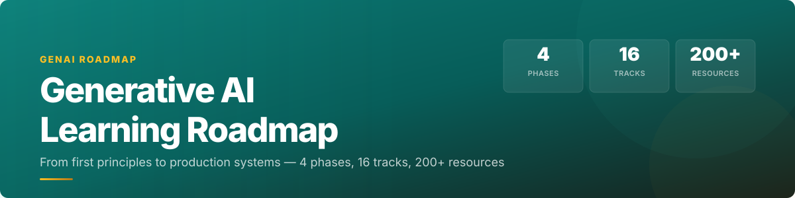

<p align="center">
  <a href="https://iscloudready.github.io/Generative-AI-Learning-Roadmap/"></a>
</p>

<p align="center">
  <a href="https://iscloudready.github.io/Generative-AI-Learning-Roadmap/"></a>
  <a href="docs/README.md"></a>
  <a href="docs/contribution-guide.md"></a>
  <br>
  
  
  
  
</p>

---

A curated, phase-based roadmap for mastering generative AI -- from mathematical foundations to production systems. Every resource has been hand-picked for quality and organized so you know exactly what to learn next.

## Features

- **Phase-based progression** -- 4 color-coded phases, 16 tracks, each building on the last
- **Level filtering** -- Filter by Beginner, Intermediate, or Advanced to find your entry point
- **Integrated doc viewer** -- Click any doc link to read guides in a slide-over sidebar with prev/next navigation
- **Progress tracking** -- Check off resources as you complete them; all data is saved to `localStorage`
- **Dashboard** -- See tracks started, completion percentage, and resume your last-accessed track
- **Dark mode** -- Automatic system preference detection with manual toggle
- **Responsive** -- Works on desktop, tablet, and mobile

## Quick start

1. Open the **[interactive app](https://iscloudready.github.io/Generative-AI-Learning-Roadmap/)** in your browser
2. Browse the four phases, expand a phase to see its tracks
3. Click a **track card** to reveal its resources
4. Use the **level filter** (All / Beginner / Intermediate / Advanced) to narrow down
5. Click **doc links** to read guides in the built-in viewer
6. Check off resources as you complete them

## The four phases

| Phase | Focus | Tracks |
|---|---|---|
| **1 -- Foundations** | Mathematics, ML basics, deep learning, transformers | 4 |
| **2 -- Core LLM Engineering** | LLMs, RAG, AI agents | 3 |
| **3 -- Production & Infrastructure** | LLMOps, open-source AI, enterprise governance | 3 |
| **4 -- Applied AI** | Multimodal, product engineering, use cases, tools | 4 |
| **Reasoning & Coding** | Reasoning models, test-time compute, coding AI tools | 2 |

## Preview

```
Phase 1: Foundations           Phase 2: Core LLM Engineering
  [Introduction] ▸ 7 resources   [LLM Engineering] ▸ 28 resources
  [Scientific Foundations] ▸ 13  [RAG Systems] ▸ 16
  [Machine Learning] ▸ 24        [AI Agents] ▸ 16
  [Deep Learning] ▸ 23

Phase 3: Production            Phase 4: Applied AI
  [LLMOps & Infrastructure] ▸14  [Multimodal AI] ▸ 16
  [Open Source AI Ecosystem] ▸10 [AI Product Engineering] ▸ 9
  [Enterprise AI Governance] ▸12 [Real-World Use Cases] ▸ 11
                                  [Tools & Frameworks] ▸ 18

+ Reasoning Models (Advanced, 8) | Coding AI & Dev Tools (Intermediate, 8)
```

## Structure

```
data/
  resources.js          # Single source of truth for all tracks and resources
assets/
  app.js                # Application logic (sidebar viewer, progress, filters, theme)
  styles.css            # Styles with light + dark theme support
  hero-banner.svg       # README header image
docs/                   # Deep-dive guides for each track
index.html              # Interactive web app
```

---

## Full resource catalog

Below is the original comprehensive resource listing for offline reference. All resources are also available in the interactive app with progress tracking, filters, and the built-in doc viewer.

## 🏁 Introduction

Welcome to the **Generative AI Learning Roadmap**! 🎉 This guide is a comprehensive resource, covering **free courses**, **videos**, **articles**, and **books** that will take you from the fundamentals of Machine Learning and NLP to the advanced world of Generative AI. Whether you're a beginner or an experienced AI enthusiast, this roadmap provides a structured path for deep learning.

### 🔗 Credits
This guide is curated from a collection of resources shared on LinkedIn, Twitter, and other social media channels, as well as suggestions from renowned educational institutions and leading AI organizations including **Microsoft**, **OpenAI**, **Google**, **IBM**, **AWS**, **Stanford**, **Harvard**, and more.

---

## 📚 Table of Contents
- [Documentation Hub](#documentation-hub)
- [Beginner Level](#beginner-level)
- [Intermediate Level](#intermediate-level)
- [Advanced Level](#advanced-level)
- [Specialized Generative AI Courses](#specialized-generative-ai-courses)
- [LangChain and Prompt Engineering](#langchain-and-prompt-engineering)
- [Advanced Reading & Research](#advanced-reading--research)
- [Additional Resources](#additional-resources)
  - [A-Z of Machine Learning](#a-z-of-machine-learning)
  - [Courses from DeepLearning.AI](#courses-from-deeplearningai)
  - [Extra Resources](#extra-resources)
  - [Books 📖](#books-📖)
  - [Articles 📝](#articles-📝)
- [Contributing to this Guide](#contributing-to-this-guide)
- [Closing Notes](#closing-notes)

---

## 🧭 Documentation Hub

This README is the broad resource catalog. For a deeper, modular learning path,
use the new docs folder:

- [Docs Index](docs/README.md)
- [README Deep Analysis](docs/roadmap-analysis.md)
- [Documentation Contribution Guide](docs/contribution-guide.md)
- [Roadmap v2 Overview](ROADMAP_V2.md)

Recommended starting points:

- New learners: [How to Use This Roadmap](docs/00-introduction/how-to-use-this-roadmap.md)
- ML foundations: [Machine Learning Foundations](docs/02-machine-learning-foundations/machine-learning.md)
- LLM builders: [Transformers](docs/03-deep-learning-transformers/transformers.md) and [Embeddings](docs/04-llm-engineering/embeddings.md)
- RAG builders: [Retrieval-Augmented Generation](docs/05-rag-systems/rag-overview.md)
- Agent builders: [AI Agents](docs/06-ai-agents/agents.md)
- Production engineers: [LLMOps and AI Infrastructure](docs/07-ai-infrastructure/llmops.md)
- Enterprise teams: [Enterprise AI Governance](docs/09-enterprise-ai/governance.md)

---

## 🧑‍🏫 Beginner Level

### Courses
- **Python for Data Science, AI & Development -- IBM**  
  🔗 [Course Link](https://www.coursera.org/learn/python-for-applied-data-science-ai)  
  **Description:** Learn Python basics, data types, and functions for Data Science.

- **Machine Learning Fundamentals -- Stanford University**  
  🔗 [Course Link](https://www.coursera.org/specializations/machine-learning-introduction)  
  **Description:** Covers ML basics like linear regression, decision trees, and model evaluation.

- **AI for Everyone -- DeepLearning.AI**  
  🔗 [Course Link](https://www.coursera.org/learn/ai-for-everyone)  
  **Description:** An introduction to AI concepts, ethics, and applications, perfect for non-technical learners.

- **Introduction to AI with Python -- Harvard University**  
   🔗 [Course Link](https://cs50.harvard.edu/ai/)  
  **Description:** A 7-week course covering AI technologies and machine learning basics.

### Videos
- **Mathematics for ML**  
  🎬 [Watch Video](https://youtu.be/oMY2uKjx_Zc)  
  **Topics Covered:** Linear algebra, calculus, and foundational math for ML.

- **Data Science Basics**  
  🎬 [Watch Video](https://youtu.be/maxyUZGB3QY)  
  **Topics Covered:** Core concepts in data science and ML fundamentals.

### Books 📖
- **"Python Crash Course" by Eric Matthes**  
  **Description:** A beginner-friendly introduction to Python, suitable for data science and AI applications.

---

## 🧑‍💻 Intermediate Level

### Courses
- **Neural Networks & Deep Learning -- DeepLearning.AI**  
  🔗 [Course Link](https://www.coursera.org/learn/neural-networks-deep-learning)  
  **Description:** Understand core architectures of neural networks and deep learning models.

- **Data Science & ML -- Harvard University**  
  🔗 [Course Link](https://pll.harvard.edu/course/data-science-machine-learning)  
  **Description:** Covers intermediate machine learning concepts, probability, and statistics.

- **Generative AI with Large Language Models -- AWS**  
  🔗 [Course Link](https://www.coursera.org/learn/generative-ai-with-llms)  
  **Description:** Build and deploy large language models (LLMs) with AWS resources.

### Videos
- **Training Embeddings for Recommendation Systems**  
  🎬 [Watch Video](https://youtu.be/DN4S96oHRhE)  
  **Topics Covered:** Key concepts in embeddings and their use in recommendation engines.

- **Data Science: Visualization**  
  🎬 [Watch Video](https://youtu.be/Y6PEpkEdXDQ)  
  **Topics Covered:** Visualizing data with Python libraries.

### Books 📖
- **"Hands-On Machine Learning with Scikit-Learn, Keras, and TensorFlow" by Aurelien Geron**  
  **Description:** A practical guide for machine learning and deep learning with Python libraries.

---

## 🧑‍🔬 Advanced Level

### Courses
- **Advanced Machine Learning on Google Cloud Specialization -- Google**  
  🔗 [Course Link](https://www.coursera.org/specializations/advanced-machine-learning-tensorflow-gcp)  
  **Description:** Covers advanced ML techniques, including model optimization and hyperparameter tuning.

- **AI Workflow: Feature Engineering and Bias Detection -- IBM**  
  🔗 [Course Link](https://www.coursera.org/learn/ibm-ai-workflow-feature-engineering-bias-detection)  
  **Description:** Focuses on data preparation, bias detection, and model validation techniques.

- **Supervised Machine Learning: Regression and Classification**  
  🔗 [Course Link](https://www.coursera.org/learn/machine-learning?id=285&irgwc=1)  
  **Description:** An in-depth course on supervised ML techniques with applications in regression and classification.

### Videos
- **Deep Residual Learning for Image Recognition**  
  🎬 [Watch Video](https://youtu.be/WQj8QtjC3gA)  
  **Topics Covered:** Understanding deep residual networks for image recognition tasks.

- **Attention Mechanisms and Transformers**  
  🎬 [Watch Video](https://youtu.be/v-0J7o-nDBE)  
  **Topics Covered:** Deep dive into attention mechanisms and transformer models.

### Books 📖
- **"Deep Learning" by Ian Goodfellow, Yoshua Bengio, and Aaron Courville**  
  **Description:** A comprehensive resource for deep learning concepts, covering theory and applications.

---

## 🌟 Specialized Generative AI Courses

### Google
- **LLMOps -- Google Cloud & DeepLearning.AI**  
  🔗 [Course Link](https://www.deeplearning.ai/short-courses/llmops/)  
  **Description:** Learn LLM operations, from pre-processing to model deployment.

### Microsoft
- **Generative AI for Data Analysis Professional Certificate**  
  🔗 [Course Link](https://microsoft.github.io/AI-For-Beginners/)  
  **Description:** Covering data analysis and generative AI with real-world applications.

### OpenAI
- **ChatGPT Prompt Engineering for Devs**  
  🔗 [Course Link](https://www.deeplearning.ai/short-courses/chatgpt-prompt-engineering-for-developers/)  
  **Description:** OpenAI's specialized course on prompt engineering for conversational AI models.

### Gemini
- **Understanding Responsible AI -- Gemini AI Lab**  
  🔗 [Course Link](https://www.cloudskillsboost.google/course_templates/554)  
  **Description:** Focuses on responsible and ethical AI practices.

### GitHub - Awesome Generative AI
- **Awesome Generative AI Guide -- Aishwarya Reganti**  
  🔗 [Course Link](https://github.com/aishwaryanr/awesome-generative-ai-guide)  
  **Description:** A curated list of resources, tools, papers, and tutorials on generative AI. This guide covers topics like large language models (LLMs), prompt engineering, diffusion models, and more. Perfect for learners at all levels seeking structured and high-quality AI content.

### GitHub - LLM Mastery
- **LLM Mastery In 30 Days -- Vasanth51430**  
  🔗 [Course Link](https://github.com/Vasanth51430/LLM_Mastery_In_30_Days)  
  **Description:** A comprehensive 30-day roadmap to master Large Language Models (LLMs). This resource guides learners through NLP fundamentals, transformer models, fine-tuning, and deploying LLMs in real-world applications. Perfect for those looking for structured learning on LLMs and prompt engineering.

---

## 💡 LangChain and Prompt Engineering

- **LangChain Prompt Templates**  
   🔗 [Course Link](https://python.langchain.com/docs/concepts/prompt_templates/)  
  **Description:** Building and applying prompt templates in LangChain.

- **LangChain ChatBots Memory**  
  🔗 [Docs Link](https://docs.langchain.com/oss/python/concepts/memory)  
  **Description:** Official LangChain and LangGraph memory concepts for short-term and long-term agent memory.

---

## 📚 Advanced Reading & Research

### Ilya Sutskever's Top 30 Reading List
This section includes influential research papers and readings recommended by Ilya Sutskever, a pioneer in the AI and machine learning field. These papers are foundational for understanding neural networks, LSTMs, and other advanced AI concepts.

1. [The First Law of Complexodynamics](https://scottaaronson.blog/?p=762) -- Scott Aaronson
2. [The Unreasonable Effectiveness of Recurrent Neural Networks](https://karpathy.github.io/2015/05/21/rnn-effectiveness/) -- Andrej Karpathy
3. [Understanding LSTM Networks](https://colah.github.io/posts/2015-08-Understanding-LSTMs/) -- Christopher Olah
4. [Recurrent Neural Network Regularization](https://arxiv.org/abs/1409.2329) -- Zaremba et al.
5. [Keeping Neural Networks Simple by Minimizing the Description Length of the Weights](https://www.cs.toronto.edu/~hinton/absps/colt93.pdf) -- Hinton & van Camp
6. [Pointer Networks](https://arxiv.org/abs/1506.03134) -- Vinyals et al.
7. [ImageNet Classification with Deep Convolutional Neural Networks](https://papers.nips.cc/paper/4824-imagenet-classification-with-deep-convolutional-neural-networks) -- Krizhevsky et al. (AlexNet)
8. [Order Matters: Sequence to Sequence for Sets](https://arxiv.org/abs/1511.06391) -- Vinyals et al.
9. [GPipe: Easy Scaling with Micro-Batch Pipeline Parallelism](https://arxiv.org/abs/1811.06965) -- Huang et al.
10. [Deep Residual Learning for Image Recognition](https://arxiv.org/abs/1512.03385) -- He et al. (ResNet)
11. [Multi-Scale Context Aggregation by Dilated Convolutions](https://arxiv.org/abs/1511.07122) -- Yu & Koltun
12. [Neural Message Passing for Quantum Chemistry](https://arxiv.org/abs/1704.01212) -- Gilmer et al.
13. [Attention is All You Need](https://arxiv.org/abs/1706.03762) -- Vaswani et al. (Transformer)
14. [Neural Machine Translation by Jointly Learning to Align and Translate](https://arxiv.org/abs/1409.0473) -- Bahdanau et al. (Attention)
15. [Identity Mappings in Deep Residual Networks](https://arxiv.org/abs/1603.05027) -- He et al.
16. [A Simple Neural Network Module for Relational Reasoning](https://arxiv.org/abs/1706.01427) -- Santoro et al.
17. [Variational Lossy Autoencoder](https://arxiv.org/abs/1611.02731) -- Chen et al.
18. [Relational Recurrent Neural Networks](https://arxiv.org/abs/1806.01822) -- Santoro et al.
19. [Quantifying the Rise and Fall of Complexity in Closed Systems: the Coffee Automaton](https://arxiv.org/abs/1405.6903) -- Aaronson et al.
20. [Neural Turing Machines](https://arxiv.org/abs/1410.5401) -- Graves et al.
21. [Deep Speech 2: End-to-End Speech Recognition in English and Mandarin](https://arxiv.org/abs/1512.02595) -- Amodei et al.
22. [Scaling Laws for Neural Language Models](https://arxiv.org/abs/2001.08361) -- Kaplan et al.
23. [A Tutorial Introduction to the Minimum Description Length Principle](https://arxiv.org/abs/math/0406077) -- Grunwald
24. [Machine Super Intelligence](https://www.vetta.org/documents/Machine_Super_Intelligence.pdf) -- Shane Legg (PhD thesis)
25. [Kolmogorov Complexity and Algorithmic Randomness](https://www.lirmm.fr/~ashen/kolmbook-eng-scan.pdf) -- Shen, Uspensky, Vereshchagin
26. [Stanford's CS231n Convolutional Neural Networks for Visual Recognition](https://cs231n.github.io/) -- Stanford / Fei-Fei Li et al.
27. [Dense Passage Retriever (DPR)](https://arxiv.org/abs/2004.04906) -- Karpukhin et al.
28. [Retrieval-Augmented Generation for Knowledge-Intensive NLP Tasks](https://arxiv.org/abs/2005.11401) -- Lewis et al. (RAG)
29. [Zephyr: Direct Distillation of LM Alignment](https://arxiv.org/abs/2310.16944) -- Tunstall et al.
30. [Lost in the Middle: How Language Models Use Long Contexts](https://arxiv.org/abs/2307.03172) -- Liu et al.

---

## 📘 Additional Resources

### 🔹 A-Z of Machine Learning

- 🎯 [Mathematics for ML](https://youtu.be/oMY2uKjx_Zc)
- 🎯 [Linear Regression](https://www.youtube.com/watch?v=-OVHiTZofN0&list=PL89V0TQq5GLpnZlZMeUa8EAmM-v9QqXqQ)
- 🎯 [Logistic Regression](https://www.youtube.com/watch?v=0zlDF9A4UiY&list=PL89V0TQq5GLrK1_bXqci8lkaikCliD4I6)
- 🎯 [Data Science Basics](https://youtu.be/maxyUZGB3QY), [Alternative Link](https://youtu.be/Y6PEpkEdXDQ)
- 🎯 [Isotonic Regression](https://youtu.be/lo3rUyk9qi0)
- 🎯 [ML Metrics for Classification](https://youtu.be/E2HRSJKU-_4)
- 🎯 [Categorical Variable Encoding Strategies](https://youtu.be/MKuAQv6ybc8)
- 🎯 [Naive Bayes Classifier](https://youtu.be/IvTCdrx1SHQ)
- 🎯 [Dimensionality Reduction (PCA, AutoEncoders)](https://www.youtube.com/watch?v=bjaTz-7BnMY)
- 🎯 [Entropy, Cross-Entropy, KL-Divergence](https://www.youtube.com/watch?v=hJ8-NauTj2s)
- 🎯 [Probability, Model Calibration](https://youtu.be/rG2EfFOXyg0)
- 🎯 [Data Drift Detection, Model Monitoring](https://youtu.be/tQjRQWfYQ10)
- 🎯 [Dynamic Pricing in Ecommerce](https://youtu.be/a_CXpnsvPa0)
- 🎯 [Training Embeddings for Recommendation Systems](https://youtu.be/DN4S96oHRhE)
- 🎯 [ANN in Recsys (Annoy)](https://youtu.be/DSQOrBTqmYA)
- 🎯 [ANN in Recsys (Product Quantizer)](https://youtu.be/50PNumB7s3U)
- 🎯 [Model-Based Recommendations @ Twitter](https://youtu.be/Xqo8fwgjxW4)
- 🎯 [PID Controller for Diversity in Recommender Systems](https://youtu.be/laTxgnzjfR0)
- 🎯 [Instagram's Recommendation System](https://youtu.be/Myna6rnmCG8)
- 🎯 [Train Neural Networks to Approximate Any Function](https://youtu.be/4PvGKuqRQTE)
- 🎯 [BERT for Embeddings](https://youtu.be/v-0J7o-nDBE)
- 🎯 [Twitter's Recommendation Algorithm](https://youtu.be/IhGq9jgcxFM)
- 🎯 [Model Compression with Knowledge Distillation](https://youtu.be/1N_EBJUOjVU)
- 🎯 [Conversational AI (Chat-GPT)](https://youtu.be/JKoJ5YIr2O4)
- 🎯 [Dual Nature of Conversational LLMs](https://youtu.be/MHfzoHC4kek)
- 🎯 [Enhancing LLMs](https://youtu.be/mF7OM_XU2S4)
- 🎯 [Falcon & LLAMA-2](https://youtu.be/CxqZ5j3xlt0), [Second Video](https://youtu.be/8cc4bJtycOA)
- 🎯 [Supercharging LLama-2 & Falcon](https://youtu.be/paGr-t1wSOQ), [Alternate Link](https://youtu.be/lo11Iczb0Vc)
- 🎯 [SRKGPT AI with Shahrukh Khan's Style](https://youtu.be/gYPwx0DR7zc)
- 🎯 [LinkedIn's CTR Modeling](https://youtu.be/7l0HLYVFEuU)
- 🎯 [Meituan's Two-Tower Recsys Model](https://youtu.be/UhpbTSbi3lI)
- 🎯 [Twitter & Instagram Recommender Systems](https://youtu.be/PaDsiJCPCXQ)
- 🎯 [Scalable Query-Item Two-Tower Model](https://youtu.be/o-pZk5R0TZg)
- 🎯 [Overcoming Biases in Recsys](https://youtu.be/oGb_mIdO0tA)
- 🎯 [Evolution of Recsys](https://youtu.be/lgoyJn7MsH8)
- 🎯 [Multi-Armed Bandit Strategies](https://youtu.be/2A5f3GrX0dA)
- 🎯 [Uplift Modeling to Detect Causal Effect](https://youtu.be/rKzG0Ct_ReA)
- 🎯 [Netflix's Unified Recommendation ML Model](https://youtu.be/OKmv9sUrvk8)
- 🎯 [Netflix's Calibrated Recommendations](https://youtu.be/DOWXNrBpO4w)
- 🎯 [Intro to GANs & Stable Diffusion](https://youtu.be/KUeq-wszG80)
- 🎯 [PySpark Essentials](https://youtu.be/aruptWppgSs)
- 🎯 [LinkedIn's Budget Pacing for Targeted Ads](https://youtu.be/R4EZ92VJvSI)
- 🎯 [Detecting Buyer-side Returns Fraud](https://youtu.be/as4i1tUo0EA)
- 🎯 [ML System to Combat Counterfeit Fraud in E-Commerce](https://youtu.be/YQZBgvLB_EQ)
- 🎯 [Transparent Machine Learning with GenAI](https://youtu.be/PPl0MRuCKLo)
- 🎯 [Pinterest Ranking: GBDT to Deep Learning](https://youtu.be/WQj8QtjC3gA)

### 🔹 Courses from DeepLearning.AI

- [AI for Everyone](https://www.deeplearning.ai/ai-for-everyone/)
- [Generative AI with Large Language Models](https://www.deeplearning.ai/courses/generative-ai-with-llms/)
- [Deep Learning Specialization](https://www.deeplearning.ai/courses/deep-learning-specialization/)
- [Structuring Machine Learning Projects](https://www.coursera.org/learn/machine-learning-projects)
- [Improving Deep Neural Networks](https://www.coursera.org/learn/deep-neural-network)
- [AI for Medicine](https://www.deeplearning.ai/courses/ai-for-medicine-specialization/)
- [Natural Language Processing Specialization](https://www.deeplearning.ai/courses/natural-language-processing-specialization/)
- [Generative Adversarial Networks](https://www.deeplearning.ai/courses/generative-adversarial-networks-gans-specialization/)
- [AI for Good](https://www.deeplearning.ai/courses/ai-for-good/)

### 🔹 Extra Resources

- 📚 [Stanford CS229: Building Large Language Models](https://cs229.stanford.edu/)
- 🎓 [Learn Generative AI in 21 Hours](https://www.freecodecamp.org/news/learn-generative-ai-for-developers/)
- 🎥 [NVIDIA Online Courses](https://learn.nvidia.com/)
- 🧠 [LLM Evaluation](https://github.com/EleutherAI/lm-evaluation-harness)
- 📝 [Awesome Generative AI Guide](https://github.com/aishwaryanr/awesome-generative-ai-guide)

---

## 📖 Books 📖

1. **"Generative Deep Learning: Teaching Machines to Paint, Write, Compose, and Play" by David Foster**  
   **Description:** A guide to generative models and their applications in creative fields.

2. **"Natural Language Processing with Transformers" by Lewis Tunstall, Leandro von Werra, and Thomas Wolf**  
   **Description:** Practical guide to working with transformer-based NLP models.

3. **"The Hundred-Page Machine Learning Book" by Andriy Burkov**  
   **Description:** A concise yet comprehensive overview of machine learning concepts.

4. **"Machine Learning Yearning" by Andrew Ng**  
   **Description:** Free book offering insights into how to structure ML projects effectively.

---

## 📝 Articles 📝

- **"Attention is All You Need"**  
  📄 [Read Article](https://arxiv.org/abs/1706.03762)  
  **Description:** Foundational paper on the Transformer model, revolutionizing NLP.

- **"Understanding LSTMs" by Christopher Olah**  
  📄 [Read Article](https://colah.github.io/posts/2015-08-Understanding-LSTMs/)  
  **Description:** An illustrated guide to Long Short-Term Memory (LSTM) networks.

- **"Scaling Laws for Neural Language Models"**  
  📄 [Read Article](https://arxiv.org/abs/2001.08361)  
  **Description:** Research on scaling language models and their impacts on performance.

---

## 📊 Categorized Resources

### Machine Learning

| **Category**       | **Topic**                                      | **Resource Type**     | **Link** |
|--------------------|------------------------------------------------|-----------------------|----------|
| Machine Learning   | Mathematics for ML                             | Video                 | [Watch](https://youtu.be/oMY2uKjx_Zc) |
| Machine Learning   | Linear Regression                              | Course                | [Link](https://developers.google.com/machine-learning/crash-course/linear-regression) |
| Machine Learning   | Logistic Regression                            | Course                | [Link](https://developers.google.com/machine-learning/crash-course/logistic-regression) |
| Machine Learning   | Naive Bayes Classifier                         | Video                 | [Watch](https://youtu.be/IvTCdrx1SHQ) |
| Machine Learning   | Dimensionality Reduction (PCA, AutoEncoders)   | Course                | [Link](https://scikit-learn.org/stable/modules/decomposition.html) |
| Machine Learning   | Data Science: Machine Learning (Harvard)       | Course                | [Link](https://pll.harvard.edu/course/data-science-machine-learning) |
| Machine Learning   | Machine Learning Crash Course                  | Course (Google)       | [Link](https://developers.google.com/machine-learning/crash-course) |
| Machine Learning   | Data Science: Linear Regression (Harvard)      | Course                | [Link](https://pll.harvard.edu/course/data-science-linear-regression/2023-10) |

### Statistics

| **Category**       | **Topic**                                      | **Resource Type**     | **Link** |
|--------------------|------------------------------------------------|-----------------------|----------|
| Statistics         | Statistics Fundamentals                        | Playlist              | [Link](https://www.khanacademy.org/math/statistics-probability) |
| Statistics         | Data Science: Probability (Harvard)            | Course                | [Link](https://pll.harvard.edu/course/data-science-probability) |

### Generative AI

| **Category**       | **Topic**                                      | **Resource Type**     | **Link** |
|--------------------|------------------------------------------------|-----------------------|----------|
| Generative AI      | ChatGPT Prompt Engineering for Devs            | Course (OpenAI)       | [Link](https://www.deeplearning.ai/short-courses/chatgpt-prompt-engineering-for-developers/) |
| Generative AI      | LLMOps (Google Cloud & DeepLearning.AI)        | Course                | [Link](https://www.deeplearning.ai/short-courses/llmops/) |
| Generative AI      | Generative AI for Data Analysis (Microsoft)    | Professional Certificate | [Link](https://microsoft.github.io/AI-For-Beginners/) |
| Generative AI      | AI for Everyone (DeepLearning.AI)              | Course                | [Link](https://www.deeplearning.ai/ai-for-everyone/) |
| Generative AI      | Generative AI with Large Language Models (AWS) | Course                | [Link](https://www.coursera.org/learn/generative-ai-with-llms) |
| Generative AI      | Generative Deep Learning by David Foster       | Book                  | - |

### Programming

| **Category**       | **Topic**                                      | **Resource Type**     | **Link** |
|--------------------|------------------------------------------------|-----------------------|----------|
| Programming        | Python for Data Science, AI & Development (IBM)| Course                | [Link](https://www.coursera.org/learn/python-for-applied-data-science-ai) |
| Programming        | R Programming Fundamentals                     | Course (Stanford)     | [Link](https://www.edx.org/learn/r-programming) |
| Programming        | SQL for Data Science                           | Course                | [Link](https://www.coursera.org/learn/sql-for-data-science) |
| Programming        | MongoDB Basics                                 | Course                | [Link](https://learn.mongodb.com/) |
| Programming        | Python for Data Science (Playlist)             | Playlist              | [Link](https://www.youtube.com/playlist?list=PLP8iPy9hna6T56VX9S6H0F7RoNxiL1qL7) |

### LangChain and Prompt Engineering

| **Category**                       | **Topic**                            | **Resource Type**     | **Link** |
|------------------------------------|--------------------------------------|-----------------------|----------|
| LangChain and Prompt Engineering   | LangChain Prompt Templates           | Course                | [Link](https://python.langchain.com/docs/concepts/prompt_templates/) |
| LangChain and Prompt Engineering   | Building LLM Agents Using LangChain  | Course                | [Link](https://python.langchain.com/docs/tutorials/agents/) |
| LangChain and Prompt Engineering   | LangChain Output Parsing             | Course                | [Link](https://python.langchain.com/docs/concepts/output_parsers/) |
| LangChain and Prompt Engineering   | Understanding LangChain Chains       | Course                | [Link](https://python.langchain.com/docs/concepts/chain/) |

### Other Specialized Topics

| **Category**               | **Topic**                               | **Resource Type**     | **Link** |
|----------------------------|-----------------------------------------|-----------------------|----------|
| Other Specialized Topics   | Dynamic Pricing in Ecommerce            | Video                 | [Watch](https://youtu.be/a_CXpnsvPa0) |
| Other Specialized Topics   | Transparent Machine Learning with GenAI | Video                 | [Watch](https://youtu.be/PPl0MRuCKLo) |
| Other Specialized Topics   | RAG from Scratch                        | Course                | [Link](https://python.langchain.com/docs/tutorials/rag/) |
| Other Specialized Topics   | Detecting Buyer-side Returns Fraud      | Video                 | [Watch](https://youtu.be/as4i1tUo0EA) |
| Other Specialized Topics   | LinkedIn's CTR Modeling                 | Video                 | [Watch](https://youtu.be/7l0HLYVFEuU) |
| Other Specialized Topics   | Building Large Language Models (Stanford CS229) | Course          | [Link](https://cs229.stanford.edu/) |

---

## 📈 Closing Notes

This roadmap is designed to help learners advance through different levels of understanding in Generative AI. Be consistent in your learning, practice regularly, and make the most of the amazing free resources available. Enjoy your journey toward becoming a Generative AI expert! 😄

---

## Contributing

Contributions are welcome -- whether it is adding a resource, fixing a link, or improving the documentation.

See the [contribution guide](docs/contribution-guide.md) to get started.

---

<p align="center">
  
</p>
